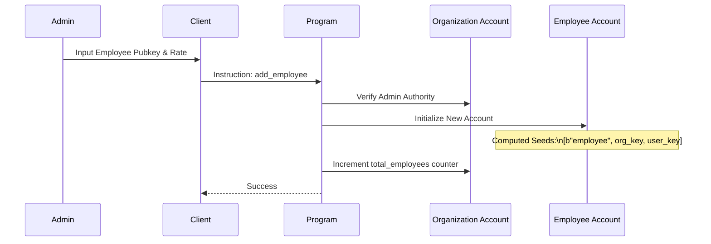
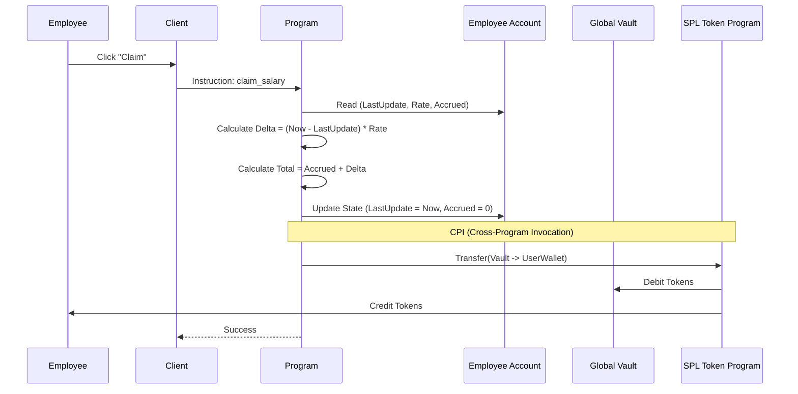
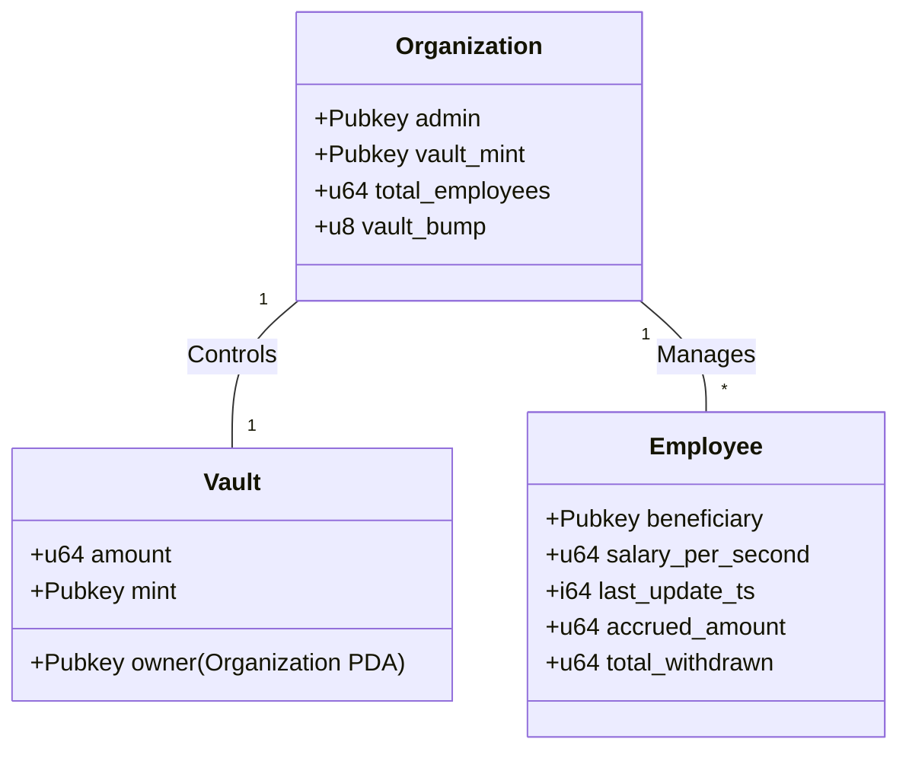

# System Overview & Architecture

## Introduction
The **Decentralized Streaming Payroll System** is a Solana-based application designed to facilitate real-time, continuous salary payments. It leverages the **Sealevel Runtime** for parallel processing and **Program Derived Addresses (PDAs)** for secure, trustless fund management.

This document provides a visual and high-level explanation of how the system components interact.

## 1. System Architecture
The system follows a standard dApp architecture where the Frontend interacts with the Blockchain via a Wallet Provider.

```mermaid
graph TD
    subgraph "Client Layer (Off-Chain)"
        UI[Next.js Frontend]
        Wallet[Wallet Adapter (Phantom/Solflare)]
    end

    subgraph "Network Layer"
        RPC[RPC Node (Helius/QuickNode)]
    end

    subgraph "Blockchain Layer (On-Chain)"
        Program[Solana Program (Bifrost)]
        
        subgraph "Data Accounts (PDAs)"
            Org[Organization Account]
            Emp[Employee Accounts (Many)]
            Vault[Token Vault (SPL Token)]
        end
    end

    UI <-->|Connects| Wallet
    Wallet <-->|Signs & Sends Tx| RPC
    RPC <-->|Forwards Tx| Program
    Program <-->|Reads/Writes| Org
    Program <-->|Reads/Writes| Emp
    Program <-->|Transfers Funds| Vault
```

### Key Components
*   **Next.js Frontend**: The user interface for Admins and Employees.
*   **Wallet Adapter**: Handles transaction signing securely.
*   **Solana Program**: The "Smart Contract" containing the business logic.
*   **PDAs**: Accounts that store state (Configuration, Users, Balances).

---

## 2. Core Workflows

### A. Employee Onboarding (Admin)
How an organization sets up the payroll.



### B. Salary Claim (Employee)
How an employee withdraws their vested earnings.



---

## 3. Data Design (Account Relationships)

The relationship between accounts ensures security and logical separation of data.



## 4. Why Solana? (Technical Advantages)

1.  **Low Fees**: High-frequency claims (e.g., daily) are viable because transaction fees are fraction of a cent.
2.  **Scalability**: The **Hub-and-Spoke** model combined with Solana's parallel runtime means 10,000 employees can claim simultaneously without clogging the network.
3.  **Capital Efficiency**: Employers deposit one lump sum into the `Vault`, rather than creating thousands of separate escrow accounts.
